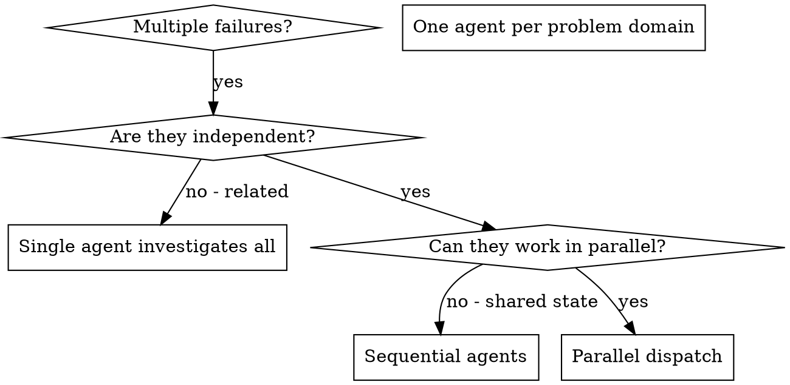

# Dispatching Parallel Agents

## Purpose
TODO: Describe the purpose in 1-2 sentences.

## When to use

**Use when:**
- 3+ test files failing with different root causes
- Multiple subsystems broken independently
- Each problem can be understood without context from others
- No shared state between investigations

**Don't use when:**
- Failures are related (fix one might fix others)
- Need to understand full system state
- Agents would interfere with each other

## When NOT to use
**Related failures:** Fixing one might fix others - investigate together first
**Need full context:** Understanding requires seeing entire system
**Exploratory debugging:** You don't know what's broken yet
**Shared state:** Agents would interfere (editing same files, using same resources)
- TODO: specify at least one situation where this skill should NOT be used.

## Inputs / Preconditions
- Required info: TODO
- Assumptions: TODO
- Constraints: TODO

## Procedure
1. TODO: refine this step with concrete actions and parameters.
2. TODO: refine this step with concrete actions and parameters.
3. TODO: refine this step with concrete actions and parameters.

## Checks
- TODO: add at least one verifiable check.

## Failure modes
- TODO: list at least one failure mode and how to detect it.

## Examples
### Example 1
TODO

## Version / Changelog
- v0.1.0: imported (autofix)

<!-- ORIGINAL_EXTRA_SECTIONS_DETECTED -->
<!-- Please review original draft for additional headings not covered by the template. -->
