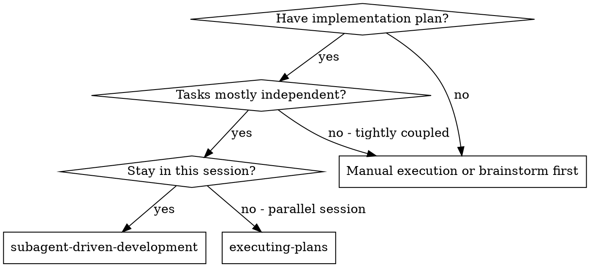

# Subagent-Driven Development

## Purpose
TODO: Describe the purpose in 1-2 sentences.

## When to use

**vs. Executing Plans (parallel session):**
- Same session (no context switch)
- Fresh subagent per task (no context pollution)
- Two-stage review after each task: spec compliance first, then code quality
- Faster iteration (no human-in-loop between tasks)

## When NOT to use
- TODO: specify at least one situation where this skill should NOT be used.

## Inputs / Preconditions
- Required info: TODO
- Assumptions: TODO
- Constraints: TODO

## Procedure
1. TODO: refine this step with concrete actions and parameters.
2. TODO: refine this step with concrete actions and parameters.
3. TODO: refine this step with concrete actions and parameters.

## Checks
- TODO: add at least one verifiable check.

## Failure modes
- TODO: list at least one failure mode and how to detect it.

## Examples
### Example 1
TODO

## Version / Changelog
- v0.1.0: imported (autofix)

<!-- ORIGINAL_EXTRA_SECTIONS_DETECTED -->
<!-- Please review original draft for additional headings not covered by the template. -->
